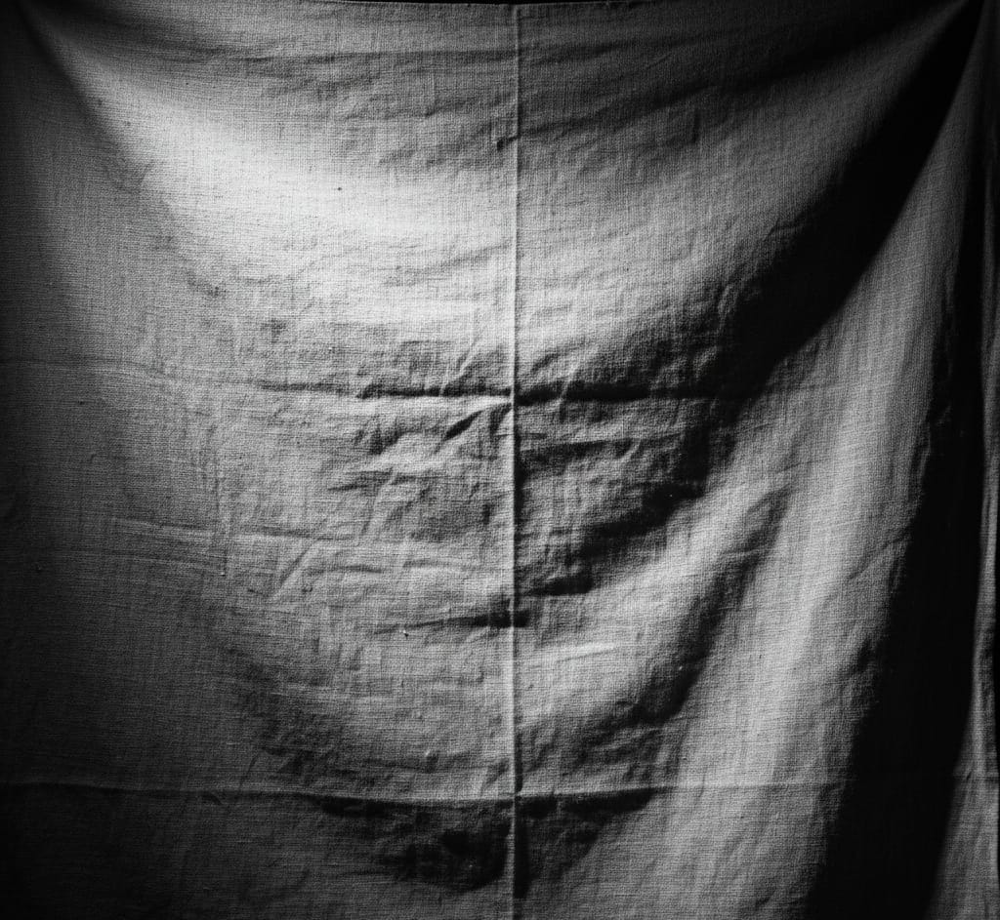

# illumination_invariant_texture_recovery
Recover intrinsic textures from unevenly lit images using homomorphic filtering, frequency-domain analysis, and chromaticity-preserving color correction

## Project Overview

This project addresses the challenge of recovering the *true texture of a surface* from a single grayscale or color image under *uneven illumination. Uneven lighting often masks or distorts the underlying surface patterns, and simple enhancement techniques like histogram equalization fail to recover the **intrinsic texture*.  

Using homomorphic filtering, this project separates **reflectance (texture) from illumination (lighting variations) by leveraging their frequency characteristics in the image.

*Goals of this Project:*
- Extract illumination-invariant texture from grayscale and color images.
- Estimate smooth illumination maps.
- Implement both manual and optimized Fourier transforms for educational and practical purposes.
- Provide *quantitative evaluation* (MSE, PSNR) and clear visualizations for verification.

---

## Theoretical Background

### Image Formation Model

A real-world image can be modeled as:

\[
I(x, y) = R(x, y) \times L(x, y)
\]

Where:  
- \( R(x, y) \) → Reflectance (intrinsic texture, what we want)  
- \( L(x, y) \) → Illumination (lighting, what we want to remove)  
- \( I(x, y) \) → Observed image  

### Limitations of Histogram Equalization

Histogram Equalization (HE) transforms pixel intensities globally:

\[
I_{eq}(x, y) = T[I(x, y)]
\]

Critical shortcomings of HE:  
1. *Non-separability* – Cannot separate multiplicative components \(R \times L\).  
2. *Loss of spatial information* – Ignores high-frequency texture vs low-frequency illumination.  
3. *Global vs local variations* – Treats all intensity variations equally, misinterpreting lighting as texture.  
4. *Multiplicative assumption failure* – HE assumes additive corrections, unsuitable for \(I = R \times L\).  

*Example:*  
- White paper \(R=0.9\) under dim light \(L=0.3\) → \(I=0.27\)  
- Dark fabric \(R=0.3\) under bright light \(L=0.9\) → \(I=0.27\)  
HE treats these identically, but corrections should be opposite.

---

### Homomorphic Filtering Approach

*Core Idea:* Transform multiplication into addition:

\[
\log I(x, y) = \log R(x, y) + \log L(x, y)
\]

- *Low-frequency components* → Illumination \(L(x, y)\) (smooth)  
- *High-frequency components* → Reflectance \(R(x, y)\) (textures, edges)

*Algorithm Steps:*
1. *Logarithmic Transform*: \( \log(I + \epsilon) \) to separate components.  
2. *Fourier Transform*: Convert image to frequency domain.  
3. *Frequency Filtering: Apply **Butterworth High-Pass* (reflectance) and Low-Pass (illumination) filters.  
4. *Inverse Transform*: Convert filtered components back to spatial domain.  
5. *Exponential Recovery*: \( R = \exp(\log R), \ L = \exp(\log L) \)  

*Butterworth High-Pass Filter Formula:*

\[
H(u, v) = \frac{1}{1 + (D_0 / D(u, v))^{2n}}
\]

Where:  
- \(D(u, v)\) → Distance from the DC component  
- \(D_0\) → Cutoff frequency  
- \(n\) → Filter order controlling transition sharpness  

*Why it works:*  
- Logarithmic transform makes multiplicative components additive → separable.  
- Fourier analysis separates high-frequency textures from low-frequency illumination.  
- Exponential recovery restores the original domain after filtering.  

---

## Features

### 1. Grayscale Texture Recovery
- Manual *DFT* implementation (educational, step-by-step).  
- Optimized *FFT* for real-world image sizes.  
- Quantitative metrics: *MSE, PSNR*.  
- Visualizations: original, log-domain, spectrum, recovered illumination, texture, reconstructed image.

### 2. Color Image Processing
- *Method 1:* Independent channel filtering (R, G, B separately).  
- *Method 2:* Chromaticity-preserved filtering (correct intensity, preserve color ratios).  
- *Method 3:* Gray World + Homomorphic (white balance + filtering).  
- Comparative analysis: color fidelity, computational cost, best use cases.

### 3. Comprehensive Visualization
Dependencies:
numpy
matplotlib
Pillow

from src.homomorphic_grayscale import HomomorphicTextureRecovery
processor = HomomorphicTextureRecovery(cutoff_frequency=30, filter_order=2)
R, L = processor.process_grayscale_image("images/input/textured_surface.jpg")
processor.visualize_results("images/input/textured_surface.jpg", R, L)
 usage
from src.color_homomorphic import ColorHomomorphicFiltering
from PIL import Image
import numpy as np

img = np.array(Image.open("images/input/textured_surface.jpg").convert('RGB'))
processor = ColorHomomorphicFiltering(cutoff=30, order=2, gamma_low=0.3, gamma_high=2.0)
result = processor.method2_chromaticity_preserved(img)
Quantitative Evaluation
Mean Squared Error (MSE) between original and reconstructed image.
Peak Signal-to-Noise Ratio (PSNR).
Structural similarity ensures high-quality recovery.

##  Repository Structure

Below is the organized layout of the project along with a visual overview for clarity.

```
illumination_invariant_texture_recovery/
│
├── docs/                           # Documentation and technical reports
├── images/
│   └── output/                     # Generated result images
│       ├── reflectance_vs_illumination.png
│       └── texture_input.jpeg
├── src/                            # Core implementation modules
├── requirements.txt
├── LICENSE
└── README.md
```
##  Input Image

<p align="center">
  
</p>

*Figure: Input image of the planar grid used for radial distortion estimation.*

<p align="center">
  
</p>


## How to Execute (Step-by-Step)

Step 1 — Clone the Repository
git clone https://github.com/navyasgr/illumination_invariant_texture_recovery.git
cd illumination_invariant_texture_recovery

Step 2 — Install Dependencies
pip install -r requirements.txt

Step 3 — Add Your Input Image
Place a grayscale or color textured image (like paper, fabric, or wall with shadows) into:
images/
Example:
images/textured_surface.jpg

Step 4 — Run Grayscale Illumination Recovery
python src/homomorphic_grayscale.py

This will generate:
images/output/reflectance_output.png
images/output/illumination_output.png
images/output/comparison.png

 Step 5 — Run Color Correction Mode (Optional)
python src/color_homomorphic.py


This performs spectral illumination correction while maintaining color ratios.


## Documentation
- [Technical Report (PDF)](docs/complete_techical_report.pdf)
- [Research_paper (PDF)](docs/Research_paper.pdf)

## References and Inspirations

In developing this project, I referred to several key research papers that provide foundational insights into illumination and reflectance separation, nonlinear filtering, and intrinsic texture recovery:

Gang Jun Tu et al., “Illumination and Reflectance Estimation with its Application in Foreground Detection”
Explores techniques to estimate illumination and reflectance components from a single image.
Guided my approach in modeling image formation as 
𝐼(𝑥,𝑦)=𝑅(𝑥,𝑦)×𝐿(𝑥,𝑦)
I(x,y)=R(x,y)×L(x,y) and designing strategies to separate these components effectively.

Inna Stainvas, “A Generative Model for Separating Illumination and Reflectance from Images”
Introduces generative probabilistic models for estimating intrinsic image components.
Inspired my method to smoothly estimate illumination maps while preserving the underlying texture.

Alan V. Oppenheim et al., “Nonlinear Filtering of Multiplied and Convolved Signals” (IEEE)
Classic work on nonlinear filtering of multiplicative signals, which is directly relevant to homomorphic filtering.
Provided the theoretical basis for manual log-domain filtering used to separate high-frequency textures (reflectance) from low-frequency illumination.

## Novel Contributions of This Project
While existing studies provided the foundation, this project introduces practical improvements that make illumination correction more effective and understandable:

Frequency-Domain Recovery Pipeline: A custom DFT–FFT–Butterworth workflow that cleanly separates illumination and texture in a single pass.

Color-Preserving Correction: Extends classical grayscale filtering to color images while retaining natural chromatic balance.

Interactive & Tunable Design: Users can experiment with filter parameters to observe real-time changes, making it both educational and adaptive.

Rich Visual & Quantitative Validation: Every stage—from log-domain spectra to recovered textures—is visualized with MSE/PSNR metrics, offering deeper insight than conventional methods.

## Conclusion
This project demonstrates:
Deep theoretical understanding of frequency-domain image processing
 Manual and optimized Fourier transform implementations
 Multiple color-correction strategies with trade-offs
 Quantitative analysis and comprehensive visualization
By exploiting the frequency differences between reflectance and illumination, homomorphic filtering effectively recovers the intrinsic texture of images under varying lighting conditions,which classical histogram equalization cannot achieve.
